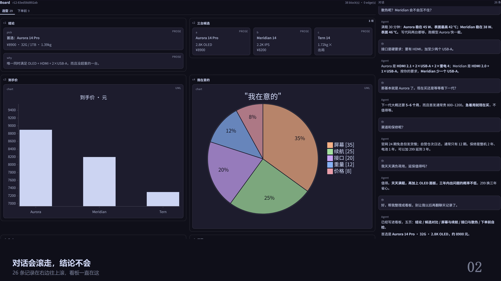
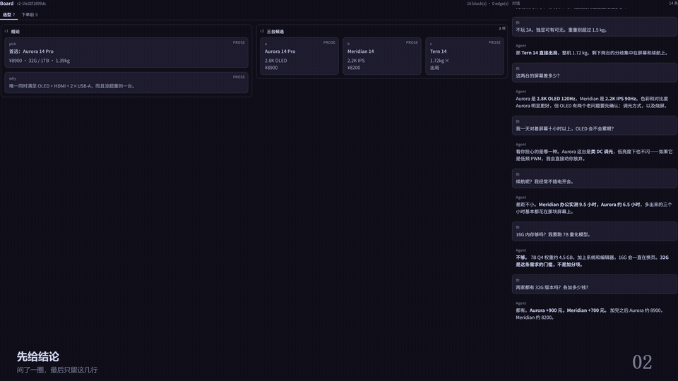

# dsh-superboard

An agent-editable board for [DeepSeek Harness](https://github.com/deepseek-ai) — 一块**超级看板**，把对话框从 UI 主体的位置换下来。



<div align="center">



*右边是对话，左边是看板。对话一直在往上滚，看板一直在往下攒——问过的，不用再问第二遍。*

</div>

---

## 这是什么

今天的**对话记录本身就是界面**。Agent 推理出的每一张图、每一个计划、每一条关系，都只能变成滚动列里的一段散文。这个插件把它反过来：

- **画布是主体。** 一个对话一块看板，一块看板多页。
- **Agent 直接编辑它。** Agent 看不到像素，它读写的是一个结构化场景模型——因为 Agent 的母语是树，不是坐标。
- **用户用手指东西。** 框选一块区域、写一句问题，就变成下一条消息里有据可依的上下文。
- **内容是拉取而不是推送。** Agent 先看大纲，再按需读它真正需要的区域，整块场景从不整个塞进上下文。

看板是**对话 / 轨迹旁边的第三个标签页**，所以聊天保留自己的家；同时它也是一块**常驻显示面**——钉在看板上的答案不会滚进历史里再被重新读一遍。

## 现在能做什么

### 看板

- **多页看板**，作用域是**对话**（一个对话一块看板）。
- **八种块**：标题 / 正文 / 列表 / 代码 / UML / 图片 / PDF 页 / 分组。
- **容器可嵌套**：`group` 里可以再放 `group`，层级不限。
- **六种排版模板**：`flow`（竖排）/ `row`（横排换行）/ `columns`（N 等分列）/ `grid`（卡片填满宽度）/ `masonry`（瀑布流，卡片各随高度）/ `canvas`（不排版，只做个盒子）。
  **没有任何块带坐标**——容器声明它怎么安排子块，坐标不是块的事。
- **`grid` 上的 `areas`**：用名字声明格子，从而表达跨行跨列。

  ```jsonc
  { "template": "grid",
    "params": { "areas": ["导航 正文 正文 正文",
                          "导航 侧栏 页脚 工具条",
                          "日志 备注 状态 状态",
                          "图表 图表 图表 图表"] } }
  ```

  单元格里写的是**子块引用**（slug / 别名 / id），`.` 是空位。每行格子数必须相同，同一个名字必须占一个**实心矩形**。这是用来表达「让正文横跨两列、让导航竖跨两行」这类排版的。
- **`masonry` 瀑布流**：卡片保持各自高度、按列顺次填充（`cols` 指定列数，或 `minCardWidth` 让宽度决定）。`grid` 的行轨道高等于该行最高的卡，所以短卡旁边会留空；`masonry` 就是「把空间填满」的那个模板。它是 CSS multi-column，因此内容超过一栏后**按列优先**填充——顺序敏感的内容不要用它。
- **`uml` 块自己渲染**：mermaid 源码在浏览器侧跑，图跟随主题；渲染失败的原因会回到 Agent 手里，而不是卡上留个红框。
- **有向语义箭头**，端点可以精确到块的内部——九种锚点：整块 / 字段（`title`、`code`、`caption`、`filename`）/ 列表项 / 代码行段 / 文本区间（带引文）/ 子块 / UML 节点 / 矩形 / 点。
- **region**：只做标注和底色，**不参与排版**（要排版请用 `group`）。一个块最多属于一个 region。
- **revision 闸**：每次写入都要带 `expected_revision`，并发写会被拒绝而不是静默覆盖。

### 工具（刻意只有四个）

| 工具 | 作用 |
| --- | --- |
| `board_outline` | 整块看板的骨架：页面、块、箭头、失败渲染 |
| `board_read` | 按需读取真正的文本——页面、块、箭头、region |
| `board_apply` | **唯一写入口**，一批有序操作原子生效 |
| `board_query` | 沿箭头提问（谁依赖 X、X 指向谁、两点之间怎么走） |

支撑它们的还有：**常驻大纲**（每步注入一小段，细节由 Agent 按需拉取，所以从没打开过看板的对话不会为此花掉提示预算），以及两个投影（`board`、`boardActivity`）。

### 读对话（看板右侧的阅读栏）

- 与看板**同屏**的对话阅读栏，可拖宽，宽度持久化。
- **只显示对话**：`user` 与 `assistant` 的文本。思考过程和工具调用被过滤掉——不是靠设置，而是这两种节点本来就不带文本块。
- **自带 markdown 渲染**：标题、列表、引用、围栏代码、表格、行内样式与链接。渲染器只构造 React 元素，**从不拼 HTML 字符串**——看板文本是 Agent 写的，而 Agent 读到的内容不受控。
- **「加载更早」直接生效**，不需要切走标签页再切回来。

### 框选反馈

- 在看板上拖框选中 → 浮动输入条出现 → 写一句问题 → **追加到输入框**（不是替用户发送）。
- 追加时做两件事：把一段**可读摘要**写进草稿，让 Agent 不用花一次工具调用去开附件就知道用户选中了什么；同时把**结构化选区**作为 JSON 附件带上。
- **永不代替用户发送。**

## 装它

本仓库目前以 DSH bundle 的形式装进某个 profile（开发期用的是 `link:`，装在 `desktop`）。

```jsonc
// profile 的 package.json
"dsh-superboard": "link:E:/Dev/dsh-superboard"
```

然后在 profile 目录跑一次 `pnpm install --no-frozen-lockfile`。

**为什么必须是 `link:` 而不是 `file:`、装完怎么自查、为什么要重启 DSH、卸载怎么做**——这几条都踩过坑，写在 [`CONTRIBUTING.md`](CONTRIBUTING.md#安装开发期)。

## 文档

| 文档 | 内容 |
| --- | --- |
| [`docs/design/design-tree.md`](docs/design/design-tree.md) | 设计访谈的四轮问题与 15 条决定，含被否决的选项和原因 |
| [`docs/design/board-model.md`](docs/design/board-model.md) | 模型契约：块、容器、模板、箭头锚点、region、revision 语义 |
| [`docs/research/dsh-plugin-contract.md`](docs/research/dsh-plugin-contract.md) | 逐条行号引用的框架约束清单（最容易踩的那些） |
| [`skills/board-layout/SKILL.md`](skills/board-layout/SKILL.md) | **给 Agent 看的排版说明**：渲染器实际怎么排版，以及哪些字段没有视觉效果 |
| [`CONTRIBUTING.md`](CONTRIBUTING.md) | 开发、测试、目录结构、预设实现约束、四源码约束、完整文档索引 |
| [`video/README.md`](video/README.md) | 发布宣传片：分镜、真实渲染的做法与复现步骤 |

完整的调研文档清单在 [`CONTRIBUTING.md`](CONTRIBUTING.md#文档索引)。

## 发布宣传片

一支 95 秒的片子，**没有配音**，九个镜头全部加载**发布版** `src/client.js` 在无头 Edge 里真渲染，再由 CDP 逐帧截——不画假的看板界面。

[`video/README.md`](video/README.md) 里有分镜表、技术做法和复现步骤。成片（18.6 MB）作为构建产物，不进版本库。

## 状态

**v1 完成并在用。** 428 个测试通过；模型版本 5；三个看板专属的 agent 预设（工程师 / 教师 / 研究员，其中**教师预设未完成**，自动朗读留待后续）。

## License

MIT — 见 [`LICENSE`](LICENSE)。
